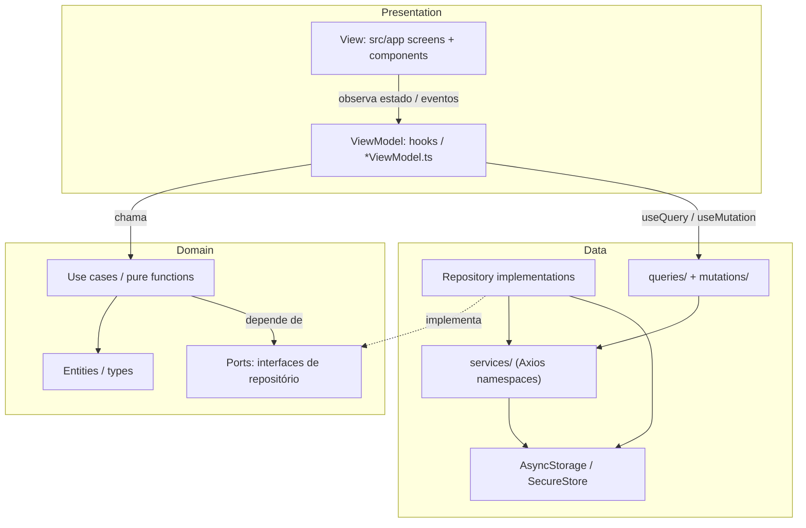

# Arquitetura visual — TokenTracker

Este arquivo é o **mapa** do código. Leia isto quando não souber *onde* colocar um arquivo.

## Ideia em uma frase

**Telas só mostram. ViewModels orquestram. Domínio decide. Data busca.**

```text
┌─────────────────────────────────────────────────────────────┐
│  PRESENTATION (UI)                                          │
│  src/app/*  +  src/presentation/*                           │
│  Telas Expo Router · componentes · ViewModels (hooks)       │
└───────────────────────────┬─────────────────────────────────┘
                            │ chama (não conhece API HTTP)
                            ▼
┌─────────────────────────────────────────────────────────────┐
│  DOMAIN (regras de negócio)                                 │
│  src/domain/*                                               │
│  Entidades · casos de uso · cálculos (% consumido)          │
│  ★ SEM React Native · SEM fetch · SEM SecureStore           │
└───────────────────────────┬─────────────────────────────────┘
                            │ usa interfaces (ports)
                            ▼
┌─────────────────────────────────────────────────────────────┐
│  DATA (infraestrutura)                                      │
│  src/data/*                                                 │
│  APIs · repositórios · storage · adapters Cursor            │
└─────────────────────────────────────────────────────────────┘
```

## Clean Architecture + MVVM (como encaixa)



### MVVM no app

| Papel | O que é | Onde fica |
| --- | --- | --- |
| **Model** | Tipos + regras + ports | `src/domain/` |
| **ViewModel** | Estado da tela, loading, erro, ações | `src/presentation/viewmodels/` |
| **View** | JSX / layout | `src/app/` + `src/presentation/components/` |

```text
Usuário toca na tela
        │
        ▼
   [ View ]  ──só renderiza──►  mostra progress %
        │
        │ onRefresh()
        ▼
 [ ViewModel ] ──chama──►  GetCursorTokenUsage (use case)
        │                           │
        │ atualiza uiState          ▼
        │                    [ Repository port ]
        │                           │
        │                           ▼
        │                    [ CursorApiAdapter ]  ← data/
        ◄──── usage ────────────────┘
```

## Árvore de pastas alvo

```text
src/
├── app/                      # SOMENTE rotas (Expo Router)
│   ├── _layout.tsx           # providers (Query) + import global.css
│   └── ...
├── domain/                   # Coração do app (testável sem UI)
│   └── tokens/
│       ├── types.ts
│       ├── calculate-consumed-percent.ts
│       └── ports/
│           └── token-usage-repository.ts
├── data/                     # Implementações concretas
│   ├── http/
│   │   └── client.ts         # instância Axios
│   ├── services/             # requests por domínio (namespaces)
│   │   ├── conect.ts         # namespace Conect → get/put/patch/del/…
│   │   └── index.ts
│   ├── queries/              # TanStack Query — GET
│   ├── mutations/            # TanStack Query — PUT / PATCH / DELETE (/ POST)
│   ├── storage/
│   │   └── async-storage.ts  # wrapper Async Storage (não sensível)
│   └── tokens/
│       ├── cursor-token-usage-repository.ts
│       └── cursor-api-client.ts
├── presentation/             # UI + ViewModels
│   ├── providers/
│   │   └── query-provider.tsx
│   ├── viewmodels/
│   │   └── use-cursor-token-progress.ts
│   └── components/
│       └── token-progress-bar.tsx   # só quando UI liberada
└── shared/                   # utilitários sem regra de negócio
    └── env.ts
```

### HTTP + TanStack Query (padrão)

```text
ViewModel
   → data/queries/*     (GET / useQuery)
   → data/mutations/*   (PUT | PATCH | DELETE | POST / useMutation)
        → data/services/conect.ts  (namespace Conect + Axios)
             → data/http/client.ts
```

- **Services**: um arquivo por API/domínio; exportam `namespace` com métodos tipados.
- **Queries**: só leitura (GET).
- **Mutations**: escritas; invalidam query keys no sucesso.
- Telas **não** importam Axios direto.

Dependência **só para dentro/baixo**:

```text
app / presentation  →  domain  ←  data
         ✗ data não importa presentation
         ✗ domain não importa data nem React
```

## O que vai em cada camada (checklist rápido)

| Se você está… | Coloque em… |
| --- | --- |
| Calculando `% consumido` | `domain/` |
| Definindo `TokenUsage` | `domain/` |
| Chamando API / lendo env / SecureStore / AsyncStorage | `data/` (`http/`, `services/`, `storage/`) |
| Hook TanStack Query (GET) | `data/queries/` |
| Hook TanStack Mutation (PUT/PATCH/DELETE) | `data/mutations/` |
| Expondo `percent`, `isLoading`, `refresh()` para a tela | `presentation/viewmodels/` |
| JSX, estilos, progress bar | `app/` ou `presentation/components/` |
| Spec / plan / tasks | `specs/` (não em `src/`) |

## TDD: o que testar onde

```text
domain/     → muitos testes unitários (rápidos, obrigatórios)
data/       → poucos testes com mocks de HTTP/storage
viewmodels/ → testes de estado (opcional no MVP)
views/      → evitar unit de layout; E2E depois
```

Skill do agente: `.cursor/skills/tdd/SKILL.md`.

## Relação com SDD

```text
specs/constitution.md     → princípios (inclui esta arquitetura)
specs/architecture.md     → ESTE mapa visual
specs/features/001-.../   → o quê construir agora
.cursor/rules/            → o agente não quebra as camadas
.cursor/skills/tdd/       → ritual red → green → refactor
```
